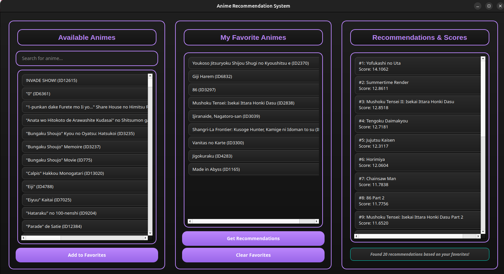

# AnimeRecBERT: BERT-Based Anime Recommendation System

**AnimeRecBERT** is a personalized anime recommendation system based on BERT transformer architecture. Adapted from [https://github.com/jaywonchung/BERT4Rec-VAE-Pytorch](https://github.com/jaywonchung/BERT4Rec-VAE-Pytorch), this project introduces customizations tailored for an anime recommendation system and inference.

- 🕒 **No positional encoding**, since the dataset contains no temporal information, i removed positional encoding and it performed better.
- 🎌 **Anime-specific user-item dataset**
- 🖥️ **GUI interface** for real-time recommendations

## Web Demo Available
🌐https://animerecbertweb-production.up.railway.app/

This project provides a solid foundation for further development in personalized anime recommendation using transformer-based models.

## Metrics
The model trained on a large-scale dataset with 560,000 users and 54 million ratings. Below are the Top-K recommendation metrics:

<table>
<tr>
<td>

| Metric       | Value    |
|--------------|----------|
| Recall@100   | 0.9998   |
| NDCG@100     | 0.733    |
| Recall@50    | 0.994    |
| NDCG@50      | 0.732    |
| Recall@20    | 0.967    |
| NDCG@20      | 0.727    |
| Recall@10    | 0.919    |
| NDCG@10      | 0.715    |
| Recall@5     | 0.841    |
| NDCG@5       | 0.689    |
| Recall@1     | 0.507    |
| NDCG@1       | 0.507    |

</td>
<td>


</td>
</tr>
</table>

## Setup & Usage
### Clone Repo

```bash
git clone https://github.com/MRamazan/AnimeRecBERT
cd AnimeRecBERT
```

###  Create & Activate venv
#### For Linux
```
python3 -m venv venv
source venv/bin/activate 
```

#### For Windows
```
python -m venv venv
venv\Scripts\activate 
```


### Download Dataset & Pretrained Model

#### For Linux
```bash
curl -L -o Data/AnimeRatings54M/animeratings-mini-54m.zip \
     https://www.kaggle.com/api/v1/datasets/download/tavuksuzdurum/animeratings-mini-54m

unzip Data/AnimeRatings54M/animeratings-mini-54m.zip -d Data/AnimeRatings54M/
```

#### For Windows
```bash
curl -L -o Data\AnimeRatings54M\animeratings-mini-54m.zip `
     https://www.kaggle.com/api/v1/datasets/download/tavuksuzdurum/animeratings-mini-54m

Expand-Archive -Path 'Data\AnimeRatings54M\animeratings-mini-54m.zip' -DestinationPath 'Data\AnimeRatings54M'
```

### Install Requirements
Install PyTorch from https://pytorch.org/get-started/locally/
```bash
pip install -r requirements.txt
```

### All Done, Start GUI
Some model parameters depends on the dataloader statistics.
Instead of setting these parameters as constants, the code processes and save the data as in training, but will only use mappings.
This way, changes in the original data won't cause an error.
```bash
python inference_gui.py \
  -c Data/AnimeRatings54M/pretrained_bert.pth \
  -d Data/preprocessed/AnimeRatings54M_min_rating7-min_uc10-min_sc10-splitleave_one_out/dataset.pkl \
  -a Data/AnimeRatings54M/animes.json \
  --inference True \
  --template train_bert        
```

### Train Code (**Not Required for inference**)
you can set parameters in templates.py file
```bash
# This script will train, validate and test the model.
# Training not required for inference.
python main.py  --template train_bert             
```

### GUI


# Results
## 🌟 My Favorites (Input for Inference)

| #  | Anime Title                                                                |
|----|----------------------------------------------------------------------------|
| 1  | Youkoso Jitsuryoku Shijou Shugi no Kyoushitsu e                            |
| 2  | Giji Harem                                                                 |
| 3  | Ijiranaide, Nagatoro-san                                                   |
| 4  | 86 (Eighty-Six)                                                            |
| 5  | Mushoku Tensei: Isekai Ittara Honki Dasu                                   |
| 6  | Made in Abyss                                                              |
| 7  | Shangri-La Frontier: Kusoge Hunter, Kamige ni Idoman to su                 |
| 8  | Vanitas no Karte                                                           |
| 9  | Jigokuraku                                                                 |

## 🌟 BERT Recommendations Based on My Favorites
**Note:** The *position of favorites does not affect inference results*, as the model uses only the presence of items (not sequence).

## 🏆 Top Anime Recommendations for Me

| Rank | Anime Title                                                                 | Score    |
|------|------------------------------------------------------------------------------|----------|
| #1   | Yofukashi no Uta                                                            | 14.1062  |
| #2   | Summertime Render                                                           | 12.8611  |
| #3   | Mushoku Tensei II: Isekai Ittara Honki Dasu                                 | 12.8518  |
| #4   | Tengoku Daimakyou                                                           | 12.7181  |
| #5   | Jujutsu Kaisen                                                              | 12.3117  |
| #6   | Horimiya                                                                     | 12.0604  |
| #7   | Chainsaw Man                                                                | 11.7838  |
| #8   | 86 Part 2                                                                   | 11.7756  |
| #9   | Mushoku Tensei: Isekai Ittara Honki Dasu Part 2                             | 11.6520  |
| #10  | Ore dake Level Up na Ken (Solo Leveling)                                    | 11.6396  |
| #11  | Kage no Jitsuryokusha ni Naritakute! 2nd Season                             | 11.6270  |
| #12  | Youkoso Jitsuryoku Shijou Shugi no Kyoushitsu e 2nd Season                 | 11.5398  |
| #13  | Sousou no Frieren                                                           | 11.5376  |
| #14  | Tonikaku Kawaii (Tonikawa: Over the Moon for You)                          | 11.5205  |
| #15  | Cyberpunk: Edgerunners                                                      | 11.5020  |
| #16  | Tenki no Ko (Weathering With You)                                           | 11.5014  |
| #17  | Dandadan                                                                     | 11.4893  |
| #18  | Spy x Family                                                                | 11.4581  |
| #19  | Make Heroine ga Oosugiru!                                                  | 11.4468  |
| #20  | Boku no Kokoro no Yabai Yatsu                                              | 11.4122  |


### ✅ Evaluation: How Good Are the Recommendations?

Out of the Top 20 recommendations, **10 titles** were already in my completed/favorites list — showing strong personalization performance.


| Watched & Liked? ✅ | Title                                                                 |
|---------------------|------------------------------------------------------------------------|
| ✅                  | Mushoku Tensei II: Isekai Ittara Honki Dasu                            |
| ✅                  | Mushoku Tensei: Isekai Ittara Honki Dasu Part 2                        |
| ✅                  | Youkoso Jitsuryoku Shijou Shugi no Kyoushitsu e 2nd Season                           |
| ✅                  | Make Heroine ga Oosugiru!                                              |
| ✅                  | Spy x Family                                                           |
| ✅                  | Dandadan                                                               |
| ✅                  | 86 Part 2                      |
| ✅                  | Jujutsu Kaisen                                                         |
| ✅                  | Chainsaw Man                                                           |
| ✅                  | Cyberpunk: Edgerunners                                                            |

*I’m genuinely excited to watch the remaining anime as well — even with a quick glance, it’s clear they’re a great fit for my taste.*


