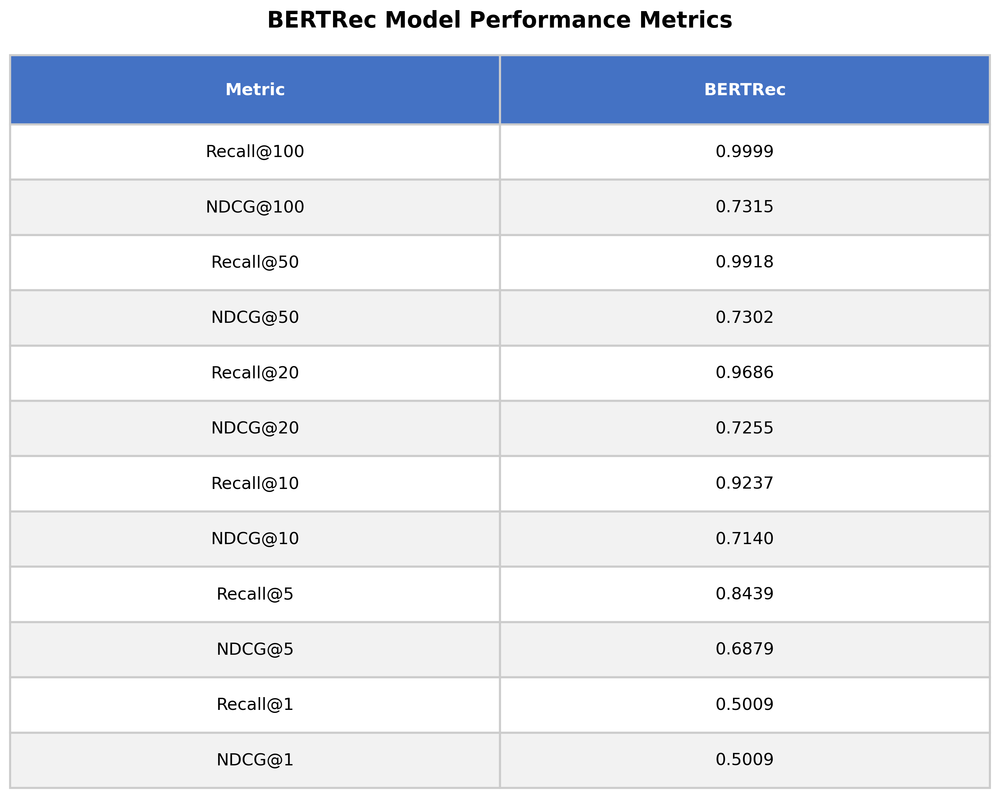

# AnimeRecBERT: BERT-Based Anime Recommendation System

**AnimeRecBERT** is a personalized anime recommendation system based on BERT transformer architecture. Inspired from [https://github.com/jaywonchung/BERT4Rec-VAE-Pytorch](https://github.com/jaywonchung/BERT4Rec-VAE-Pytorch), this project introduces customizations tailored for an anime recommendation system and inference.

- 🕒 **No positional encoding**, since the dataset contains no temporal information, i removed positional encoding and it performed better.
- 🎌 **Anime-specific user-item dataset**
- 🖥️ **GUI interface** for real-time recommendations

This project provides a solid foundation for further development in personalized anime recommendation using transformer-based models.

## Metrics
The model trained on a large-scale dataset with 560,000 users and 54 million ratings. Below are the Top-K recommendation metrics:

<table>
<tr>
<td>

| Metric       | Value    |
|--------------|----------|
| Recall@100   | 0.9998   |
| NDCG@100     | 0.733    |
| Recall@50    | 0.994    |
| NDCG@50      | 0.732    |
| Recall@20    | 0.967    |
| NDCG@20      | 0.727    |
| Recall@10    | 0.919    |
| NDCG@10      | 0.715    |
| Recall@5     | 0.841    |
| NDCG@5       | 0.689    |
| Recall@1     | 0.507    |
| NDCG@1       | 0.507    |

</td>
<td>



</td>
</tr>
</table>

## Setup & Usage

### Download Dataset & Pretrained Model

```bash
curl -L -o Data/AnimeRatings54M/animeratings-mini-54m.zip \
     https://www.kaggle.com/api/v1/datasets/download/tavuksuzdurum/animeratings-mini-54m

unzip Data/AnimeRatings54M/animeratings-mini-54m.zip -d Data/AnimeRatings54M/
```

### Install Requirements
Install PyTorch from https://pytorch.org/get-started/locally/
```bash
pip install requirements.txt
```

### All Done, Start GUI
```bash
python inference.py   -c Data/AnimeRatings54M/pretrained_bert.pth /
                      -d Data/preprocessed/AnimeRatings54M_min_rating7-min_uc10-min_sc10-splitleave_one_out/dataset.pkl /
                      -a Data/animes.json /
                      --template train_bert
```
